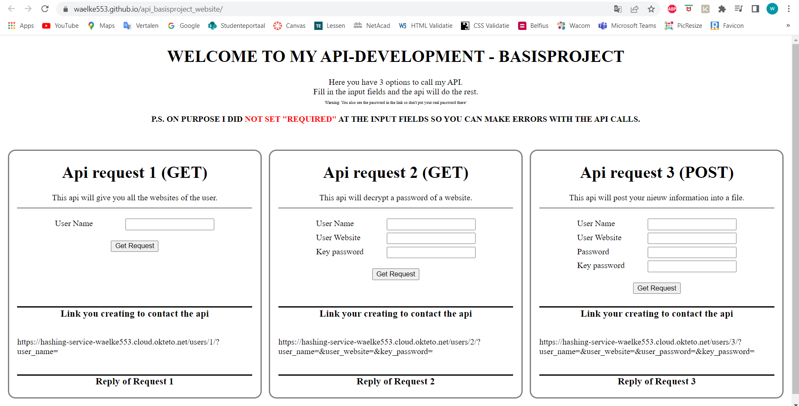
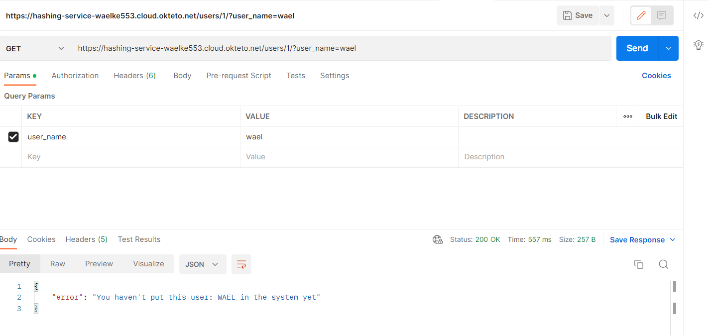
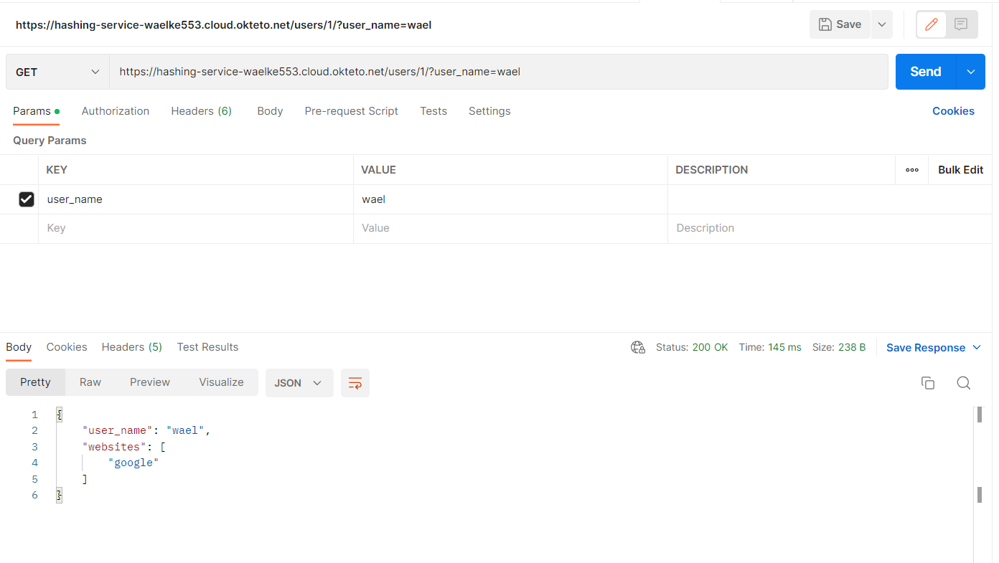
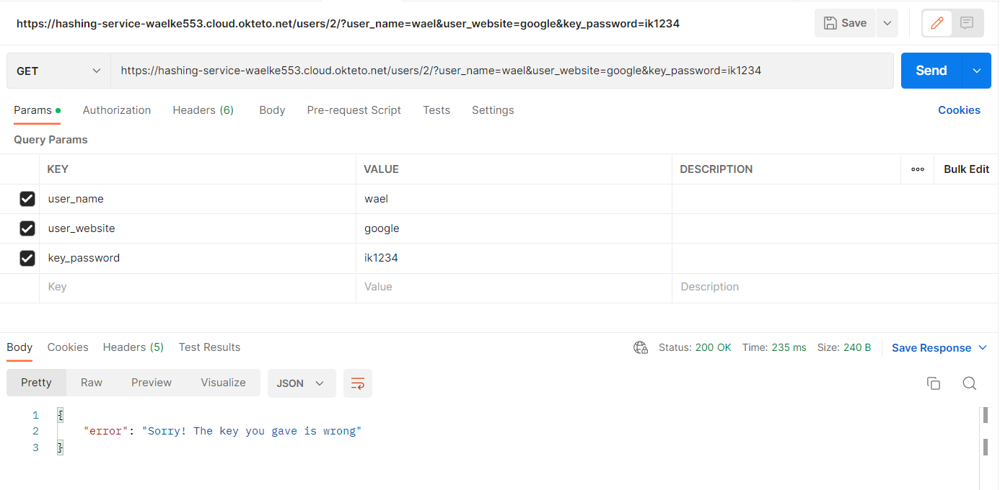
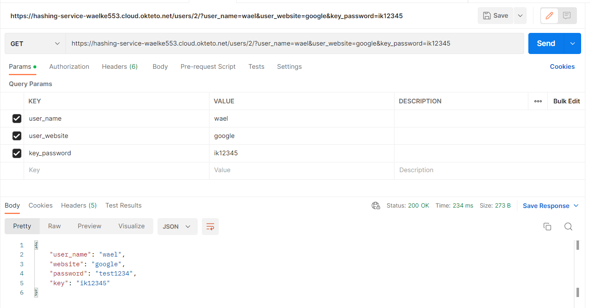
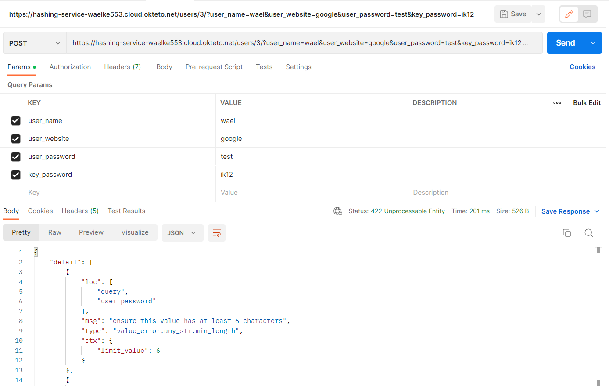
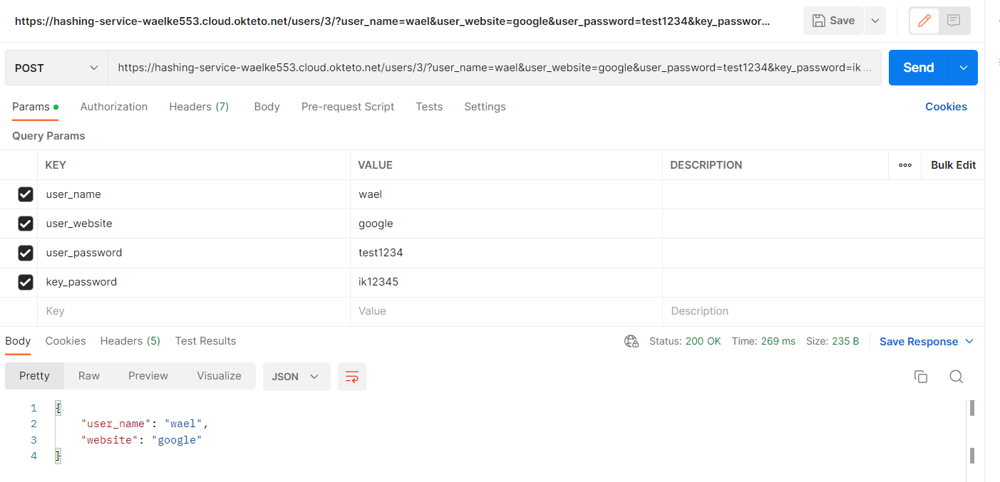
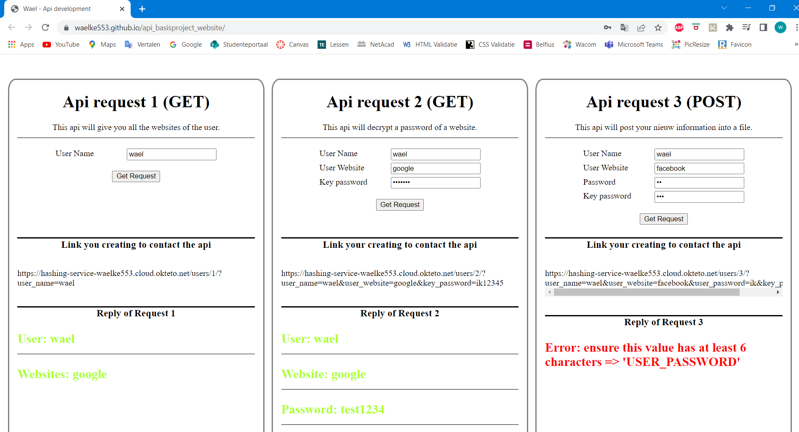
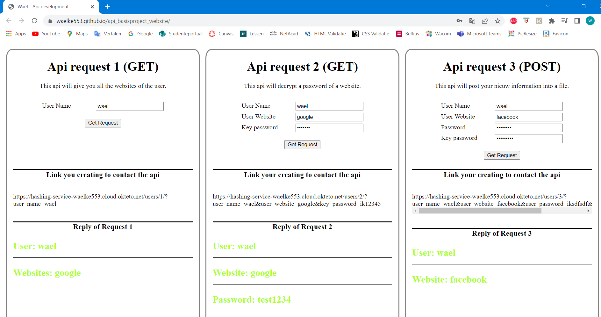

# api_basisproject

Voor dit project heb ik ervoor gekozen om rond het thema hashing te werken. Mijn inspiratie kwam van een programma/plug-in op google chrome. Waar je per site je wachtwoorden kunt versleutelen. En u kunt de versleutelde wachtwoorden ontsleutelen via 1 sleutelwachtwoord.

# Project inhoud

Maar in mijn project heb ik ervoor gekozen dat een gebruiker zijn wachtwoord per site kan versleutelen via een sleutelwachtwoord. De gebruiker moet wel zijn sluetelwachtwoord meegeven met de api om zijn wachtwoord te willen ontcijferen. 
En alleen dan wordt het echte wachtwoord voor die website gedecodeerd.

Daarnaast heb ik ook voor mijn api gekozen voor een deel "PATH" parameters te gebruiken. Maar grotendeels zijn "Query" parameters. Zodaning dat ik controle erop kan voeren.

Ik heb ook een json-bestandsstructuur ontwikkeld om aan te tonen dat ik de leerstof dat ik heb geleerd op dit project kon toepassen.

Voor deze api heb ik ook een front-end aan gekoppeld om de api gemakkelijk te gebruiken. 
Ik heb ook gitlab gebruikt om mijn html-website te hosten. (Zie foto)

# Python bibliotheken

Python-bibliotheken die ik voor dit project heb gebruikt, worden hieronder weergegeven.

1. Cryptography
2. Json
3. Os
4. Fastapi
5. Pydantic

Ik heb "cryptography" gebruikt om strings te coderen en te dycrepteren. Ik gebruik "json" om een json-bestand te lezen en te schrijven. "Os" wordt gebruikt om een bestand op het systeem aan te maken als het nog niet bestond. "Fastapi" wordt gebruikt om een api te maken. Ik heb "pydantic" gebruikt om klassen te maken met het basismodel.

# Soorten API's

Voor dit project heb ik 2 'GET' api's waarvan eentje je de websites van de gebruiker teruggeeft. En de tweede geeft u het gecodeerde wachtwoord als u het juiste sleutelwachtwoord meegeeft opgeeft.

Tot slot heb ik ook nog een 'POST' api waarmee je een nieuwe gebruiker kunt voorzien van een website en wachtwoord en key-wachtwoord. En mijn python-code zal het voor je opslaan in een json-bestand.

## Foto's

### Postman foto's

API - Get Method - Fout melding

API - Get Method - Inorde 

API - Get Method - Fout melding 

API - Get Method - Inorde 

API - Post Method - Fout melding (Vereiste waren niet okey (Query))

API - Post Method - Inorde 

### Front-end foto's

Front-end - API calls gemaakt waarvan de post method niet inorde was

Front-end - API calls gemaakt waarvan alles inorde was

# Algemene eisen & Documentatie (+65%) [Wat de leerling denk dat goed is gegaan]
## Algemeen

- [x] 1 API in een GitHub repository
- [x] 1 front-end in een GitHub repository
- [x] Beschrijving van het gekozen thema, je API en je front-end + link naar hosted API, link naar front-end GitHub repository en link naar hosted front-end op GitHub README.md
- [x] Aantoonbare werking totale API door screenshots van Postman requests op GitHub README.md
- [x] Volledige OpenAPI docs screenshot(s) op GitHub README.md

## REST API

- [x] Minstens 2 GET endpoints 
- [x] Minstens 1 POST endpoint met class(es)
- [x] Maximaal gebruik van validaties. Gebruik van response model wanneer aangewezen.
- [x] Logisch gebruik van path parameters, query parameters en body

## Deploying 

- [x] Docker container voor de API, welke automatisch door GitHub Actions opgebouwd wordt
- [x] Deployment van de API container op Okteto Cloud via Docker Compose

## Front-end

- [x] Een simpele front-end, minstens op basis van AlpineJS (Heb hier meerderheid javascript geschreven. Maar ik heb wel AlphineJS gebruikt voor sommige delen om aan te tonen dat ik het heb gebruikt.)
- [x] Deployment van de front-end

## Suggesties voor bijkomende componenten

- [x] Stijlgeving op de front-end (+5%)
- [ ] Interactie van je API met een andere externe service, API of databank (+15%)
- [ ] Eigen inspiratie… (+?%)

# URL Links

Github Repository: Hier zit u op
Github Repository voor front-end: [GitHub Repo - Front-end Link](https://github.com/waelke553/api_basisproject_website)
Hosted API: [Okteto - Hosted API Link](https://hashing-service-waelke553.cloud.okteto.net)
Hosted front-end: [Github - Hosted Front-end Link](https://waelke553.github.io/api_basisproject_website/)

Bijkomende commentaar, aanvullingen, enz:

Bij mijn front-end kan je zien dat als je de invoervelden invult. Dat je de link gewoon met het blote oog kunt zien. Ook als is je wachtwoord met bolletjes is dit niet bij de link.

Typ dus NIET uw gebruikte wachtwoorden!
